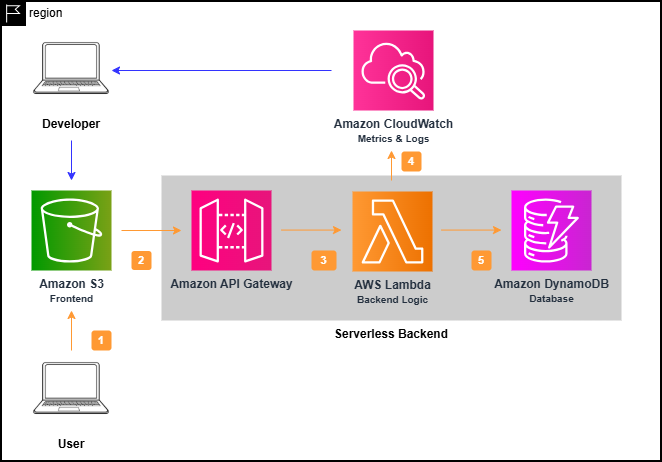

# ☕ Coffee Shop - Serverless Web Application

> Ứng dụng web bán cà phê trực tuyến được xây dựng với kiến trúc serverless trên AWS


Link trang web: "http://coffee-shop-frontend-hoangcon.s3-website-ap-southeast-1.amazonaws.com"


## Tổng quan

Coffee Shop là một ứng dụng web thương mại điện tử hiện đại cho phép người dùng duyệt, đặt hàng và quản lý các sản phẩm cà phê trực tuyến. Dự án được xây dựng với kiến trúc **Serverless** hoàn toàn trên AWS, tận dụng các dịch vụ managed để giảm thiểu chi phí vận hành và tăng khả năng mở rộng.

## Kiến trúc hệ thống



### Tech Stack

#### Frontend
- **ReactJS** - UI Framework
- **React Router** - Client-side routing
- **Vite** - Build tool & dev server
- **CSS** - Styling

#### Backend (AWS Serverless)
- **Amazon S3** - Static website hosting
- **API Gateway** - RESTful API endpoints
- **AWS Lambda** - Serverless compute (Node.js 20.x)
- **DynamoDB** - NoSQL database
- **IAM** - Access management

#### Infrastructure as Code
- **Terraform** - Infrastructure provisioning và quản lý tài nguyên AWS

## Cấu trúc dự án

```
coffee-shop/
├── src/                          # Frontend source code
│   ├── components/               # React components
│   │   ├── auth/                # Authentication components
│   │   ├── common/              # Shared components
│   │   └── product/             # Product components
│   ├── context/                 # React Context (State management)
│   ├── hooks/                   # Custom React hooks
│   ├── pages/                   # Page components
│   ├── services/                # API services
│   ├── utils/                   # Utility functions
│   └── models/                  # Data models
│
├── terraform/                    # Infrastructure as Code
│   ├── modules/                 # Terraform modules
│   │   ├── api-gateway/        # API Gateway configuration
│   │   ├── dynamodb/           # DynamoDB tables
│   │   ├── iam/                # IAM roles & policies
│   │   ├── lambda/             # Lambda functions
│   │   ├── lambda-layer/       # Lambda layers
│   │   └── s3-frontend/        # S3 hosting
│   ├── lambda-src/             # Lambda function source code
│   │   ├── create-order/
│   │   ├── get-orders/
│   │   ├── login-user/
│   │   ├── register-user/
│   │   └── update-user/
│   ├── environments/           # Environment configs
│   └── main.tf                 # Main Terraform configuration
│
├── docs/                        # Documentation
├── dist/                        # Build output
└── public/                      # Static assets
```

